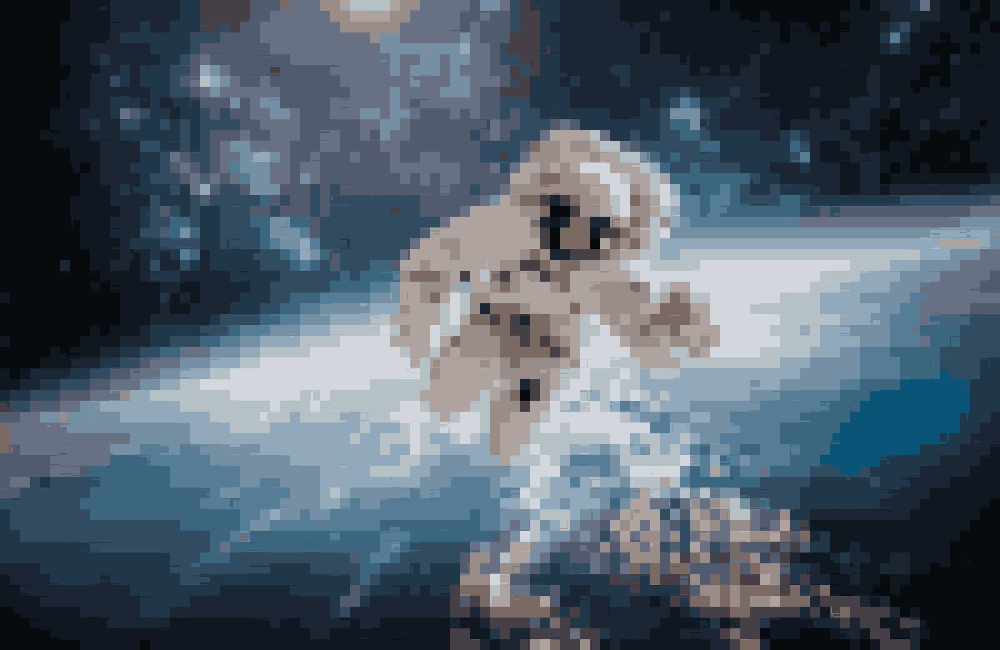

# pixelator

This program was created to pixelate and compress the colours in images using k-means clustering and various python libraries. It takes an image, the desired new dimensions of pixels and the number of colours to use. Then it creates the desired number of pixels in the image and alters the colours so there is the specified number of different colours used. For user convenience, the new image has roughly the same number of pixels as the inputted image, the newly created "pixels" are instead blocks of pixels that are the same colour. This gives the effect of pixelization while keeping the new image at a size that is reasonable. 

As an example, here are the images created by the program to pixelate this image to have 100x60 pixels which use 18 different colours. 

This is the initial image

The image after the program pixelates it:

The final image after colour compression:

